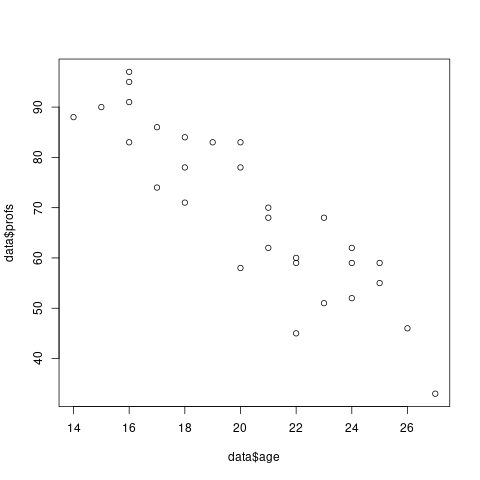
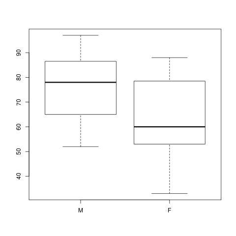
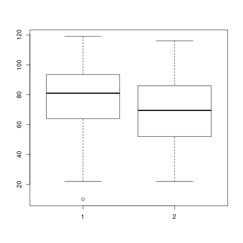
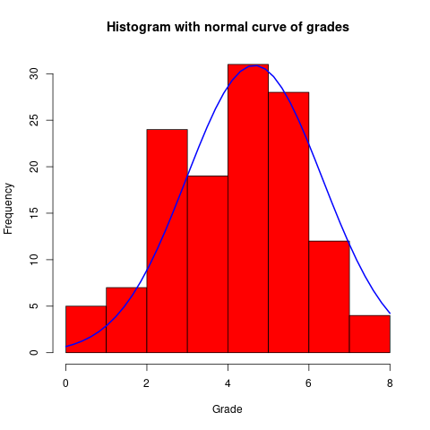

<h2>Table of Contents</h2>

<ul>
<li><a href="#sec-1">1. Practical 1</a>
<ul>
<li><a href="#sec-1-1">1.1. Question 1</a></li>
<li><a href="#sec-1-2">1.2. Question 2</a></li>
<li><a href="#sec-1-3">1.3. Question 3</a></li>
</ul>
</li>
<li><a href="#sec-2">2. Practical 2</a>
<ul>
<li><a href="#sec-2-1">2.1. Which age occurs most often?</a></li>
<li><a href="#sec-2-2">2.2. Find out what’s the mean, the median, the mode, the range and the standard deviation of the Proficiency Score in your data.</a></li>
<li><a href="#sec-2-3">2.3. Find out what is the minimum age, the maximum age, the mean age and the standard deviation.</a></li>
<li><a href="#sec-2-4">2.4. What is the most frequently occurring proficiency score</a></li>
<li><a href="#sec-2-5">2.5. What is the z-score of Participant 13?</a></li>
<li><a href="#sec-2-6">2.6. Which group has higher proficiency scores, the male or the female participants?</a></li>
<li><a href="#sec-2-7">2.7. Which group scored more homogeneously?</a></li>
<li><a href="#sec-2-8">2.8. Boxplots</a></li>
<li><a href="#sec-2-9">2.9. Part B</a></li>
</ul>
</li>
<li><a href="#sec-3">3. Practical 3</a>
<ul>
<li><a href="#sec-3-1">3.1. Part A</a>
<ul>
<li><a href="#sec-3-1-1">3.1.1. Descriptives and graphs for groups</a></li>
<li><a href="#sec-3-1-2">3.1.2. Which performed best? And which group performed most homogeneously?</a></li>
<li><a href="#sec-3-1-3">3.1.3. Which teacher performed best?</a></li>
<li><a href="#sec-3-1-4">3.1.4. Boxplot</a></li>
<li><a href="#sec-3-1-5">3.1.5. Grades</a></li>
<li><a href="#sec-3-1-6">3.1.6. How many students passed?</a></li>
<li><a href="#sec-3-1-7">3.1.7. Checking for normality</a></li>
<li><a href="#sec-3-1-8">3.1.8. Zscores</a></li>
<li><a href="#sec-3-1-9">3.1.9. Impressions about teacher gorup</a></li>
<li><a href="#sec-3-1-10">3.1.10. The Null hypothesis</a></li>
<li><a href="#sec-3-1-11">3.1.11. Defining the variables</a></li>
<li><a href="#sec-3-1-12">3.1.12. Running the test</a></li>
</ul>
</li>
<li><a href="#sec-3-2">3.2. Part B</a></li>
</ul>
</li>
</ul>

# Practical 1

Firs we begin be importing our dataset. We have to use an additional library to read an \*.xlsx file. After that we assign names to the columns. And we take a look at the first rows of the dataset to see what it looks like.

    data <- read.csv("./data/p1.csv")
    names(data) <- c("id","age","sex","profs")
    head(data)

<table border="2" cellspacing="0" cellpadding="6" rules="groups" frame="hsides">

<colgroup>
<col  class="right" />

<col  class="right" />

<col  class="right" />

<col  class="right" />
</colgroup>
<tbody>
<tr>
<td class="right">1</td>
<td class="right">16</td>
<td class="right">1</td>
<td class="right">91</td>
</tr>

<tr>
<td class="right">2</td>
<td class="right">20</td>
<td class="right">2</td>
<td class="right">58</td>
</tr>

<tr>
<td class="right">3</td>
<td class="right">24</td>
<td class="right">1</td>
<td class="right">52</td>
</tr>

<tr>
<td class="right">4</td>
<td class="right">22</td>
<td class="right">2</td>
<td class="right">45</td>
</tr>

<tr>
<td class="right">5</td>
<td class="right">18</td>
<td class="right">1</td>
<td class="right">78</td>
</tr>

<tr>
<td class="right">6</td>
<td class="right">14</td>
<td class="right">2</td>
<td class="right">88</td>
</tr>
</tbody>
</table>

## Question 1

*Does the proficiency score increase or decrease with age?*

To answer this question we might simply plot both age and proficiency score and see if there is any clear indication.

    plot(data$age,data$profs)

Well, yes, from the scatter plot we built we can see that as the age increases the proficiency decreases.

## Question 2

*Is there a difference in proficiency score between female and male participants?*

    aggregate(data$profs, by=list(Category=data$sex), FUN=mean)

<table border="2" cellspacing="0" cellpadding="6" rules="groups" frame="hsides">

<colgroup>
<col  class="right" />

<col  class="right" />
</colgroup>
<tbody>
<tr>
<td class="right">1</td>
<td class="right">75.5333333333333</td>
</tr>

<tr>
<td class="right">2</td>
<td class="right">63.6666666666667</td>
</tr>
</tbody>
</table>

## Question 3

*Is there an overall difference in age between male and female participants?*

    m <- data$age[data$sex == 1]
    f <- data$age[data$sex == 2]
    boxplot(m,f)

    aggregate(data$age, by=list(Category=data$sex), FUN=mean)

<table border="2" cellspacing="0" cellpadding="6" rules="groups" frame="hsides">

<colgroup>
<col  class="right" />

<col  class="right" />
</colgroup>
<tbody>
<tr>
<td class="right">1</td>
<td class="right">20.1333333333333</td>
</tr>

<tr>
<td class="right">2</td>
<td class="right">20.5333333333333</td>
</tr>
</tbody>
</table>

# Practical 2

    data <- read.csv("./data/p1.csv")
    names(data) <- c("id","age","sex","profs")
    str(data)

## Which age occurs most often?

    which.max(tabulate(data$age))

    16

## Find out what’s the mean, the median, the mode, the range and the standard deviation of the Proficiency Score in your data.

    mean(data$profs)

    69.6

    median(data$profs)

    69

    which.max(tabulate(data$profs))

    59

    range(data$profs)

<table border="2" cellspacing="0" cellpadding="6" rules="groups" frame="hsides">

<colgroup>
<col  class="right" />
</colgroup>
<tbody>
<tr>
<td class="right">33</td>
</tr>

<tr>
<td class="right">97</td>
</tr>
</tbody>
</table>

    sd(data$profs)

    16.4434244273069

## Find out what is the minimum age, the maximum age, the mean age and the standard deviation.

    min(data$age)

    14

    max(data$age)

    27

    mean(data$age)

    20.3333333333333

    sd(data$age)

    3.56547944576335

    sd(data$age)

    3.56547944576335

## What is the most frequently occurring proficiency score

    which.max(tabulate(data$profs))

    59

## What is the z-score of Participant 13?

    scale(data$profs,center=TRUE, scale=TRUE)[13]

    -0.462190830966998

## Which group has higher proficiency scores, the male or the female participants?

    aggregate(data$profs, by=list(Category=data$sex), FUN=mean)

<table border="2" cellspacing="0" cellpadding="6" rules="groups" frame="hsides">

<colgroup>
<col  class="right" />

<col  class="right" />
</colgroup>
<tbody>
<tr>
<td class="right">1</td>
<td class="right">75.5333333333333</td>
</tr>

<tr>
<td class="right">2</td>
<td class="right">63.6666666666667</td>
</tr>
</tbody>
</table>

## Which group scored more homogeneously?

    aggregate(data$profs, by=list(Category=data$sex), FUN=sd)

<table border="2" cellspacing="0" cellpadding="6" rules="groups" frame="hsides">

<colgroup>
<col  class="right" />

<col  class="right" />
</colgroup>
<tbody>
<tr>
<td class="right">1</td>
<td class="right">14.2421239721502</td>
</tr>

<tr>
<td class="right">2</td>
<td class="right">16.7871833197092</td>
</tr>
</tbody>
</table>

## Boxplots

    m <- data$profs[data$sex == 1]
    f <- data$profs[data$sex == 2]
    boxplot(m,f,names=c("M","F"))

## Part B

Provide the mean, the mode, the median, the range and the standard deviation.

    a <- c(3, 4, 5, 6, 7, 8, 9)
    b <- c(6, 6, 6, 6, 6, 6, 6)
    c <- c(4, 4, 4, 6, 7, 7, 10)
    d <- c(1, 1, 1, 4, 9, 12, 14)

<table border="2" cellspacing="0" cellpadding="6" rules="groups" frame="hsides">

<colgroup>
<col  class="right" />
</colgroup>
<tbody>
<tr>
<td class="right">1</td>
</tr>

<tr>
<td class="right">1</td>
</tr>

<tr>
<td class="right">1</td>
</tr>

<tr>
<td class="right">4</td>
</tr>

<tr>
<td class="right">9</td>
</tr>

<tr>
<td class="right">12</td>
</tr>

<tr>
<td class="right">14</td>
</tr>
</tbody>
</table>

    MySummary <- function(dataset) {
      m = mean(dataset)
      mode = which.max(tabulate(dataset))
      med = median(dataset)
      stdde = sd(dataset)
      results <- c(m,mode,med,stdde)
      return(results)
    }

    MySummary(a)

<table border="2" cellspacing="0" cellpadding="6" rules="groups" frame="hsides">

<colgroup>
<col  class="right" />
</colgroup>
<tbody>
<tr>
<td class="right">6</td>
</tr>

<tr>
<td class="right">3</td>
</tr>

<tr>
<td class="right">6</td>
</tr>

<tr>
<td class="right">2.16024689946929</td>
</tr>
</tbody>
</table>

    MySummary(b)

<table border="2" cellspacing="0" cellpadding="6" rules="groups" frame="hsides">

<colgroup>
<col  class="right" />
</colgroup>
<tbody>
<tr>
<td class="right">6</td>
</tr>

<tr>
<td class="right">6</td>
</tr>

<tr>
<td class="right">6</td>
</tr>

<tr>
<td class="right">0</td>
</tr>
</tbody>
</table>

    MySummary(c)

<table border="2" cellspacing="0" cellpadding="6" rules="groups" frame="hsides">

<colgroup>
<col  class="right" />
</colgroup>
<tbody>
<tr>
<td class="right">6</td>
</tr>

<tr>
<td class="right">4</td>
</tr>

<tr>
<td class="right">6</td>
</tr>

<tr>
<td class="right">2.23606797749979</td>
</tr>
</tbody>
</table>

    MySummary(d)

<table border="2" cellspacing="0" cellpadding="6" rules="groups" frame="hsides">

<colgroup>
<col  class="right" />
</colgroup>
<tbody>
<tr>
<td class="right">6</td>
</tr>

<tr>
<td class="right">1</td>
</tr>

<tr>
<td class="right">4</td>
</tr>

<tr>
<td class="right">5.59761854124889</td>
</tr>
</tbody>
</table>

# Practical 3

## Part A

As always, we begin by importing the data and taking a quick look at the first rows to see what it looks like.

    data <- read.csv("./data/p3a.csv",na="",header=TRUE)
    head(data)

<table border="2" cellspacing="0" cellpadding="6" rules="groups" frame="hsides">

<colgroup>
<col  class="right" />

<col  class="left" />

<col  class="left" />

<col  class="right" />

<col  class="right" />

<col  class="right" />

<col  class="right" />

<col  class="right" />

<col  class="right" />

<col  class="right" />

<col  class="right" />

<col  class="right" />

<col  class="right" />

<col  class="right" />

<col  class="right" />

<col  class="right" />

<col  class="right" />

<col  class="right" />

<col  class="right" />

<col  class="right" />
</colgroup>
<tbody>
<tr>
<td class="right">1</td>
<td class="left">A</td>
<td class="left">1A</td>
<td class="right">10</td>
<td class="right">5</td>
<td class="right">5</td>
<td class="right">7</td>
<td class="right">4</td>
<td class="right">2</td>
<td class="right">4</td>
<td class="right">14</td>
<td class="right">5</td>
<td class="right">5</td>
<td class="right">5</td>
<td class="right">0</td>
<td class="right">5</td>
<td class="right">0</td>
<td class="right">0</td>
<td class="right">4</td>
<td class="right">12</td>
</tr>

<tr>
<td class="right">2</td>
<td class="left">A</td>
<td class="left">1A</td>
<td class="right">12</td>
<td class="right">5</td>
<td class="right">4</td>
<td class="right">8</td>
<td class="right">4</td>
<td class="right">4</td>
<td class="right">5</td>
<td class="right">18</td>
<td class="right">5</td>
<td class="right">0</td>
<td class="right">5</td>
<td class="right">0</td>
<td class="right">0</td>
<td class="right">5</td>
<td class="right">0</td>
<td class="right">4</td>
<td class="right">17</td>
</tr>

<tr>
<td class="right">3</td>
<td class="left">A</td>
<td class="left">1A</td>
<td class="right">10</td>
<td class="right">4</td>
<td class="right">5</td>
<td class="right">6</td>
<td class="right">2</td>
<td class="right">3</td>
<td class="right">0</td>
<td class="right">8</td>
<td class="right">0</td>
<td class="right">5</td>
<td class="right">5</td>
<td class="right">0</td>
<td class="right">5</td>
<td class="right">0</td>
<td class="right">0</td>
<td class="right">4</td>
<td class="right">11</td>
</tr>

<tr>
<td class="right">4</td>
<td class="left">A</td>
<td class="left">1A</td>
<td class="right">18</td>
<td class="right">5</td>
<td class="right">6</td>
<td class="right">8</td>
<td class="right">5</td>
<td class="right">3</td>
<td class="right">4</td>
<td class="right">15</td>
<td class="right">5</td>
<td class="right">5</td>
<td class="right">5</td>
<td class="right">0</td>
<td class="right">5</td>
<td class="right">0</td>
<td class="right">5</td>
<td class="right">4</td>
<td class="right">12</td>
</tr>

<tr>
<td class="right">5</td>
<td class="left">A</td>
<td class="left">1B</td>
<td class="right">20</td>
<td class="right">5</td>
<td class="right">6</td>
<td class="right">7</td>
<td class="right">5</td>
<td class="right">4</td>
<td class="right">4</td>
<td class="right">19</td>
<td class="right">5</td>
<td class="right">5</td>
<td class="right">5</td>
<td class="right">0</td>
<td class="right">5</td>
<td class="right">0</td>
<td class="right">0</td>
<td class="right">5</td>
<td class="right">13</td>
</tr>

<tr>
<td class="right">6</td>
<td class="left">A</td>
<td class="left">1A</td>
<td class="right">16</td>
<td class="right">5</td>
<td class="right">6</td>
<td class="right">8</td>
<td class="right">6</td>
<td class="right">3</td>
<td class="right">1</td>
<td class="right">19</td>
<td class="right">0</td>
<td class="right">0</td>
<td class="right">5</td>
<td class="right">0</td>
<td class="right">5</td>
<td class="right">0</td>
<td class="right">0</td>
<td class="right">4</td>
<td class="right">11</td>
</tr>
</tbody>
</table>

Now we define the type of variables for `teacher` and `group`. More precisely, we want to define them as *factors*.

    data$group <- as.factor(data$group)
    data$teacher <- as.factor(data$teacher)
    str(data)

     null device 
              1
    [1] 6.000000 3.000000 6.000000 2.160247
    [1] 6 6 6 0
    [1] 6.000000 4.000000 6.000000 2.236068
    [1] 6.000000 1.000000 4.000000 5.597619
     
     Student. teacher group Q1 Q2 Q3 Q4 Q5 Q6 Q7 Q8 Q9 Q10 Q11 Q12 Q13 Q14 Q15 Q16
    1        1       A    1A 10  5  5  7  4  2  4 14  5   5   5   0   5   0   0   4
    2        2       A    1A 12  5  4  8  4  4  5 18  5   0   5   0   0   5   0   4
    3        3       A    1A 10  4  5  6  2  3  0  8  0   5   5   0   5   0   0   4
    4        4       A    1A 18  5  6  8  5  3  4 15  5   5   5   0   5   0   5   4
    5        5       A    1B 20  5  6  7  5  4  4 19  5   5   5   0   5   0   0   5
    6        6       A    1A 16  5  6  8  6  3  1 19  0   0   5   0   5   0   0   4
      Q17
    1  12
    2  17
    3  11
    4  12
    5  13
    6  11
    'data.frame':   130 obs. of  20 variables:
     $ Student.: int  1 2 3 4 5 6 7 8 9 10 ...
     $ teacher : Factor w/ 2 levels "A","B": 1 1 1 1 1 1 1 1 1 1 ...
     $ group   : Factor w/ 5 levels "1A","1B","1C",..: 1 1 1 1 2 1 1 1 1 1 ...
     $ Q1      : int  10 12 10 18 20 16 10 7 20 11 ...
     $ Q2      : int  5 5 4 5 5 5 3 4 4 5 ...
     $ Q3      : int  5 4 5 6 6 6 4 6 6 5 ...
     $ Q4      : int  7 8 6 8 7 8 8 6 6 7 ...
     $ Q5      : int  4 4 2 5 5 6 5 3 6 6 ...
     $ Q6      : int  2 4 3 3 4 3 3 2 3 3 ...
     $ Q7      : int  4 5 0 4 4 1 3 0 4 2 ...
     $ Q8      : int  14 18 8 15 19 19 16 14 17 17 ...
     $ Q9      : int  5 5 0 5 5 0 0 0 5 5 ...
     $ Q10     : int  5 0 5 5 5 0 5 0 5 5 ...
     $ Q11     : int  5 5 5 5 5 5 5 5 5 5 ...
     $ Q12     : int  0 0 0 0 0 0 5 0 0 0 ...
     $ Q13     : int  5 0 5 5 5 5 5 0 5 0 ...
     $ Q14     : int  0 5 0 0 0 0 0 0 0 0 ...
     $ Q15     : int  0 0 0 5 0 0 0 0 5 0 ...
     $ Q16     : num  4 4 4 4 5 4 2 5 4 4 ...
     $ Q17     : int  12 17 11 12 13 11 11 2 8 12 ...

### Descriptives and graphs for groups

Adding a `TOTAL_score` variable.

    data$TOTAL_score <- rowSums(data[,4:20])
    str(data$TOTAL_score)

    num [1:130] 87 96 68 105 108 89 85 54 103 87 ...

### Which performed best? And which group performed most homogeneously?

    best <- aggregate(data$TOTAL_score, by=list(data$group), FUN=mean)
    best$Group.1[which.max(best$x)]

    1B

    more_homo <- aggregate(data$TOTAL_score, by=list(data$group), FUN=sd)
    more_homo$Group.1[which.min(more_homo$x)]

    1C

### Which teacher performed best?

    byteacher <- aggregate(data$TOTAL_score, by=list(data$teacher), FUN=mean)

<table border="2" cellspacing="0" cellpadding="6" rules="groups" frame="hsides">

<colgroup>
<col  class="left" />

<col  class="right" />
</colgroup>
<tbody>
<tr>
<td class="left">A</td>
<td class="right">78.4</td>
</tr>

<tr>
<td class="left">B</td>
<td class="right">69.2928571428571</td>
</tr>
</tbody>
</table>

Teacher A

### Boxplot

    teacherA <- data$TOTAL_score[data$teacher == "A"]
    teacherB <- data$TOTAL_score[data$teacher == "B"]
    boxplot(teacherA,teacherB)

### Grades

    data$grade <- trunc(((data$TOTAL_score/143)*100)/10)
    str(data$grade)

    [1] 1B
    Levels: 1A 1B 1C 1D 1E
    [1] 1C
    Levels: 1A 1B 1C 1D 1E
     null device 
              1
     num [1:130] 6 6 4 7 7 6 5 3 7 6 ...

### How many students passed?

    table(data$grade >= 6)

<table border="2" cellspacing="0" cellpadding="6" rules="groups" frame="hsides">

<colgroup>
<col  class="left" />

<col  class="right" />
</colgroup>
<tbody>
<tr>
<td class="left">FALSE</td>
<td class="right">86</td>
</tr>

<tr>
<td class="left">TRUE</td>
<td class="right">44</td>
</tr>
</tbody>
</table>

### Checking for normality

    x <- data$grade
    h<-hist(x, breaks=10, col="red", xlab="Grade", main="Histogram with normal curve of grades")
    xfit<-seq(min(x),max(x),length=40)
    yfit<-dnorm(xfit,mean=mean(x),sd=sd(x))
    yfit <- yfit*diff(h$mids[1:2])*length(x)
    lines(xfit, yfit, col="blue", lwd=2)

### Zscores

    zgrades <- scale(data$grade,center=TRUE, scale=TRUE)
    round(zgrades[c(11,33,44,55)],2)

<table border="2" cellspacing="0" cellpadding="6" rules="groups" frame="hsides">

<colgroup>
<col  class="right" />
</colgroup>
<tbody>
<tr>
<td class="right">0.8</td>
</tr>

<tr>
<td class="right">-1.58</td>
</tr>

<tr>
<td class="right">1.99</td>
</tr>

<tr>
<td class="right">0.8</td>
</tr>
</tbody>
</table>

### Impressions about teacher gorup

It seems to me that teacher A is a better one.

### The Null hypothesis

*There is no difference between the two groups.*

### Defining the variables

`teacher` is the independent variable.

### Running the test

The default R's function assumes that there is non equal variance between the two groups. So we first check if that's the case, and in case the variance is equal, then we pass an additional argument to the function.

    var(teacherA)

    481.871186440678

    var(teacherB)

    554.467339544513

Well, at this point I don't know if this difference can be considered large enough to justify the use of the Welsh test. I'll run both.

    t.test(teacherA,teacherB, var.equal=TRUE)$p.value

    0.0250141709914793

    t.test(teacherA,teacherB)$p.value

    0.02426194067448

It is safe to reject the null hypothesis.

## Part B

    data <- read.csv("./data/p3b.csv",na="")
    colnames(data) <- c("partecipant","motivation","score")
    str(data)

    FALSE  TRUE 
       86    44
     null device 
              1
    [1]  0.80 -1.58  1.99  0.80
    [1] 481.8712
    [1] 554.4673
    [1] 0.02501417
    [1] 0.02426194
    'data.frame':   424 obs. of  3 variables:
     $ partecipant: int  1 2 3 4 5 6 7 8 9 10 ...
     $ motivation : Factor w/ 2 levels "High","Low": 2 2 1 2 2 2 2 1 1 1 ...
     $ score      : int  22 28 28 26 18 31 22 25 20 25 ...

Let's define Motivation as factor.

    data$motivation <- as.factor(data$motivation)
    str(data$motivation)

    Factor w/ 2 levels "High","Low": 2 2 1 2 2 2 2 1 1 1 ...

Ok, now we group the scores by motivation level.

    bymotivation <- aggregate(data$score, by=list(data$motivation), FUN=mean)

<table border="2" cellspacing="0" cellpadding="6" rules="groups" frame="hsides">

<colgroup>
<col  class="left" />

<col  class="right" />
</colgroup>
<tbody>
<tr>
<td class="left">High</td>
<td class="right">23.8842592592593</td>
</tr>

<tr>
<td class="left">Low</td>
<td class="right">22.8653846153846</td>
</tr>
</tbody>
</table>

Good. There is a difference. Now we have to understand if this difference is significative or not.

    low <- data$score[data$motivation == "Low"]
    high <- data$score[data$motivation == "High"]
    t.test(low,high)

            Welch Two Sample t-test
    
    data:  low and high
    t = -2.0046, df = 421.24, p-value = 0.04565
    alternative hypothesis: true difference in means is not equal to 0
    95 percent confidence interval:
     -2.01795621 -0.01979307
    sample estimates:
    mean of x mean of y 
     22.86538  23.88426

    round(t.test(low,high)$p.value,digits=3)

    0.046

Yes, with this *p* value the difference can be considered significative.