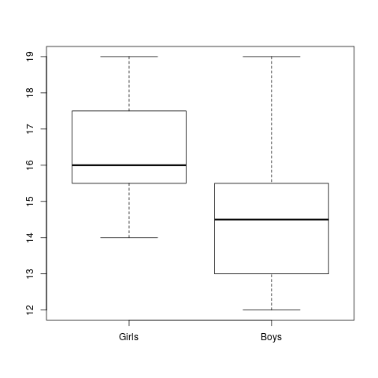

<h2>Table of Contents</h2>

<ul>
<li><a href="#sec-1">1. Practical 1</a>
<ul>
<li><a href="#sec-1-1">1.1. Question 1</a></li>
<li><a href="#sec-1-2">1.2. Question 2</a></li>
<li><a href="#sec-1-3">1.3. Question 3</a></li>
</ul>
</li>
<li><a href="#sec-2">2. Practical 2</a>
<ul>
<li><a href="#sec-2-1">2.1. Which age occurs most often?</a></li>
<li><a href="#sec-2-2">2.2. Find out what’s the mean, the median, the mode, the range and the standard deviation of the Proficiency Score in your data.</a></li>
<li><a href="#sec-2-3">2.3. Find out what is the minimum age, the maximum age, the mean age and the standard deviation.</a></li>
<li><a href="#sec-2-4">2.4. What is the most frequently occurring proficiency score</a></li>
<li><a href="#sec-2-5">2.5. What is the z-score of Participant 13?</a></li>
<li><a href="#sec-2-6">2.6. Which group has higher proficiency scores, the male or the female participants?</a></li>
<li><a href="#sec-2-7">2.7. Which group scored more homogeneously?</a></li>
<li><a href="#sec-2-8">2.8. Boxplots</a></li>
<li><a href="#sec-2-9">2.9. Part B</a></li>
</ul>
</li>
<li><a href="#sec-3">3. Practical 3</a>
<ul>
<li><a href="#sec-3-1">3.1. Part A</a>
<ul>
<li><a href="#sec-3-1-1">3.1.1. Descriptives and graphs for groups</a></li>
<li><a href="#sec-3-1-2">3.1.2. Which performed best? And which group performed most homogeneously?</a></li>
<li><a href="#sec-3-1-3">3.1.3. Which teacher performed best?</a></li>
<li><a href="#sec-3-1-4">3.1.4. Boxplot</a></li>
<li><a href="#sec-3-1-5">3.1.5. Grades</a></li>
<li><a href="#sec-3-1-6">3.1.6. How many students passed?</a></li>
<li><a href="#sec-3-1-7">3.1.7. Checking for normality</a></li>
<li><a href="#sec-3-1-8">3.1.8. Zscores</a></li>
<li><a href="#sec-3-1-9">3.1.9. Impressions about teacher gorup</a></li>
<li><a href="#sec-3-1-10">3.1.10. The Null hypothesis</a></li>
<li><a href="#sec-3-1-11">3.1.11. Defining the variables</a></li>
<li><a href="#sec-3-1-12">3.1.12. Running the test</a></li>
</ul>
</li>
<li><a href="#sec-3-2">3.2. Part B</a></li>
</ul>
</li>
<li><a href="#sec-4">4. Practical 4</a>
<ul>
<li><a href="#sec-4-1">4.1. Applying the t-test</a>
<ul>
<li><a href="#sec-4-1-1">4.1.1. What are the dependent and independent variables?</a></li>
<li><a href="#sec-4-1-2">4.1.2. What kind of measures (nominal, ordinal or interval / scale) are used for the variables?</a></li>
<li><a href="#sec-4-1-3">4.1.3. How many levels does the independent variable have?</a></li>
<li><a href="#sec-4-1-4">4.1.4. Formulate the statistical hypothesis</a></li>
<li><a href="#sec-4-1-5">4.1.5. Select an alpha level suitable for this study</a></li>
<li><a href="#sec-4-1-6">4.1.6. Which statistical test could be used ?</a></li>
<li><a href="#sec-4-1-7">4.1.7. Enter the data</a></li>
<li><a href="#sec-4-1-8">4.1.8. Provide the following descriptive statistics for both groups: means, range, minimum, maximum, standard deviations.</a></li>
<li><a href="#sec-4-1-9">4.1.9. What are your first impressions about the difference between the boys and the girls?</a></li>
<li><a href="#sec-4-1-10">4.1.10. Create a box plot to visualise the results.</a></li>
<li><a href="#sec-4-1-11">4.1.11. Test the statistical significance of this experiment</a></li>
</ul>
</li>
<li><a href="#sec-4-2">4.2. What can you say about the meaningfulness of this outcome?</a></li>
<li><a href="#sec-4-3">4.3. Consider the following data</a>
<ul>
<li><a href="#sec-4-3-1">4.3.1. What would be H0 if we want to test the relationship between reading and listening comprehension?</a></li>
<li><a href="#sec-4-3-2">4.3.2. Make a plot of the results.</a></li>
<li><a href="#sec-4-3-3">4.3.3. At face value, do you think Reading and Listening , as plotted in the graph, are related?</a></li>
<li><a href="#sec-4-3-4">4.3.4. We want to know if we can conclude that reading skills and listening comprehension are significantly related.</a></li>
<li><a href="#sec-4-3-5">4.3.5. Report</a></li>
<li><a href="#sec-4-3-6">4.3.6. Cronbach's Alpha</a></li>
</ul>
</li>
<li><a href="#sec-4-4">4.4. Testing for normality</a></li>
</ul>
</li>
<li><a href="#sec-5">5. Practical 5</a>
<ul>
<li><a href="#sec-5-1">5.1. Weight and height</a>
<ul>
<li><a href="#sec-5-1-1">5.1.1. Questions</a></li>
</ul>
</li>
<li><a href="#sec-5-2">5.2. Writing scores</a>
<ul>
<li><a href="#sec-5-2-1">5.2.1. Questions</a></li>
</ul>
</li>
<li><a href="#sec-5-3">5.3. Crosstabs</a>
<ul>
<li><a href="#sec-5-3-1">5.3.1. Questions</a></li>
</ul>
</li>
<li><a href="#sec-5-4">5.4. Exam practice</a>
<ul>
<li><a href="#sec-5-4-1">5.4.1. A) Pronunciation</a></li>
<li><a href="#sec-5-4-2">5.4.2. B) Polish learning French</a></li>
<li><a href="#sec-5-4-3">5.4.3. C) Poor Japanese</a></li>
<li><a href="#sec-5-4-4">5.4.4. D) Again</a></li>
<li><a href="#sec-5-4-5">5.4.5. E) Toddlers</a></li>
<li><a href="#sec-5-4-6">5.4.6. F) Toddlers again</a></li>
<li><a href="#sec-5-4-7">5.4.7. G) Sport and stress</a></li>
</ul>
</li>
</ul>
</li>
<li><a href="#sec-6">6. Practical 6</a>
<ul>
<li><a href="#sec-6-1">6.1. L2 syntax development</a>
<ul>
<li><a href="#sec-6-1-1">6.1.1. Report</a></li>
</ul>
</li>
<li><a href="#sec-6-2">6.2. Spanish pronunciation proficiency</a>
<ul>
<li><a href="#sec-6-2-1">6.2.1. Report</a></li>
</ul>
</li>
<li><a href="#sec-6-3">6.3. Vocabulary learning experiment</a>
<ul>
<li><a href="#sec-6-3-1">6.3.1. Report</a></li>
</ul>
</li>
<li><a href="#sec-6-4">6.4. Vocabulary scores and instruction</a>
<ul>
<li><a href="#sec-6-4-1">6.4.1. Report</a></li>
</ul>
</li>
</ul>
</li>
</ul>

# Practical 1

Firs we begin be importing our dataset. We have to use an additional library to read an \*.xlsx file. After that we assign names to the columns. And we take a look at the first rows of the dataset to see what it looks like.

    data <- read.csv("./data/p1.csv")
    names(data) <- c("id","age","sex","profs")
    head(data)

<table border="2" cellspacing="0" cellpadding="6" rules="groups" frame="hsides">

<colgroup>
<col  class="right" />

<col  class="right" />

<col  class="right" />

<col  class="right" />
</colgroup>
<tbody>
<tr>
<td class="right">1</td>
<td class="right">16</td>
<td class="right">1</td>
<td class="right">91</td>
</tr>

<tr>
<td class="right">2</td>
<td class="right">20</td>
<td class="right">2</td>
<td class="right">58</td>
</tr>

<tr>
<td class="right">3</td>
<td class="right">24</td>
<td class="right">1</td>
<td class="right">52</td>
</tr>

<tr>
<td class="right">4</td>
<td class="right">22</td>
<td class="right">2</td>
<td class="right">45</td>
</tr>

<tr>
<td class="right">5</td>
<td class="right">18</td>
<td class="right">1</td>
<td class="right">78</td>
</tr>

<tr>
<td class="right">6</td>
<td class="right">14</td>
<td class="right">2</td>
<td class="right">88</td>
</tr>
</tbody>
</table>

## Question 1

*Does the proficiency score increase or decrease with age?*

To answer this question we might simply plot both age and proficiency score and see if there is any clear indication.

    plot(data$age,data$profs)

Well, yes, from the scatter plot we built we can see that as the age increases the proficiency decreases.

## Question 2

*Is there a difference in proficiency score between female and male participants?*

    aggregate(data$profs, by=list(Category=data$sex), FUN=mean)

<table border="2" cellspacing="0" cellpadding="6" rules="groups" frame="hsides">

<colgroup>
<col  class="right" />

<col  class="right" />
</colgroup>
<tbody>
<tr>
<td class="right">1</td>
<td class="right">75.5333333333333</td>
</tr>

<tr>
<td class="right">2</td>
<td class="right">63.6666666666667</td>
</tr>
</tbody>
</table>

## Question 3

*Is there an overall difference in age between male and female participants?*

    m <- data$age[data$sex == 1]
    f <- data$age[data$sex == 2]
    boxplot(m,f)

    aggregate(data$age, by=list(Category=data$sex), FUN=mean)

<table border="2" cellspacing="0" cellpadding="6" rules="groups" frame="hsides">

<colgroup>
<col  class="right" />

<col  class="right" />
</colgroup>
<tbody>
<tr>
<td class="right">1</td>
<td class="right">20.1333333333333</td>
</tr>

<tr>
<td class="right">2</td>
<td class="right">20.5333333333333</td>
</tr>
</tbody>
</table>

# Practical 2

    data <- read.csv("./data/p1.csv")
    names(data) <- c("id","age","sex","profs")
    str(data)

## Which age occurs most often?

    which.max(tabulate(data$age))

    16

## Find out what’s the mean, the median, the mode, the range and the standard deviation of the Proficiency Score in your data.

    mean(data$profs)

    69.6

    median(data$profs)

    69

    which.max(tabulate(data$profs))

    59

    range(data$profs)

<table border="2" cellspacing="0" cellpadding="6" rules="groups" frame="hsides">

<colgroup>
<col  class="right" />
</colgroup>
<tbody>
<tr>
<td class="right">33</td>
</tr>

<tr>
<td class="right">97</td>
</tr>
</tbody>
</table>

    sd(data$profs)

    16.4434244273069

## Find out what is the minimum age, the maximum age, the mean age and the standard deviation.

    min(data$age)

    14

    max(data$age)

    27

    mean(data$age)

    20.3333333333333

    sd(data$age)

    3.56547944576335

    sd(data$age)

    3.56547944576335

## What is the most frequently occurring proficiency score

    which.max(tabulate(data$profs))

    59

## What is the z-score of Participant 13?

    scale(data$profs,center=TRUE, scale=TRUE)[13]

    -0.462190830966998

## Which group has higher proficiency scores, the male or the female participants?

    aggregate(data$profs, by=list(Category=data$sex), FUN=mean)

<table border="2" cellspacing="0" cellpadding="6" rules="groups" frame="hsides">

<colgroup>
<col  class="right" />

<col  class="right" />
</colgroup>
<tbody>
<tr>
<td class="right">1</td>
<td class="right">75.5333333333333</td>
</tr>

<tr>
<td class="right">2</td>
<td class="right">63.6666666666667</td>
</tr>
</tbody>
</table>

## Which group scored more homogeneously?

    aggregate(data$profs, by=list(Category=data$sex), FUN=sd)

<table border="2" cellspacing="0" cellpadding="6" rules="groups" frame="hsides">

<colgroup>
<col  class="right" />

<col  class="right" />
</colgroup>
<tbody>
<tr>
<td class="right">1</td>
<td class="right">14.2421239721502</td>
</tr>

<tr>
<td class="right">2</td>
<td class="right">16.7871833197092</td>
</tr>
</tbody>
</table>

## Boxplots

    m <- data$profs[data$sex == 1]
    f <- data$profs[data$sex == 2]
    boxplot(m,f,names=c("M","F"))

## Part B

Provide the mean, the mode, the median, the range and the standard deviation.

    a <- c(3, 4, 5, 6, 7, 8, 9)
    b <- c(6, 6, 6, 6, 6, 6, 6)
    c <- c(4, 4, 4, 6, 7, 7, 10)
    d <- c(1, 1, 1, 4, 9, 12, 14)

<table border="2" cellspacing="0" cellpadding="6" rules="groups" frame="hsides">

<colgroup>
<col  class="right" />
</colgroup>
<tbody>
<tr>
<td class="right">1</td>
</tr>

<tr>
<td class="right">1</td>
</tr>

<tr>
<td class="right">1</td>
</tr>

<tr>
<td class="right">4</td>
</tr>

<tr>
<td class="right">9</td>
</tr>

<tr>
<td class="right">12</td>
</tr>

<tr>
<td class="right">14</td>
</tr>
</tbody>
</table>

    MySummary <- function(dataset) {
      m = mean(dataset)
      mode = which.max(tabulate(dataset))
      med = median(dataset)
      stdde = sd(dataset)
      results <- c(m,mode,med,stdde)
      return(results)
    }

    MySummary(a)

<table border="2" cellspacing="0" cellpadding="6" rules="groups" frame="hsides">

<colgroup>
<col  class="right" />
</colgroup>
<tbody>
<tr>
<td class="right">6</td>
</tr>

<tr>
<td class="right">3</td>
</tr>

<tr>
<td class="right">6</td>
</tr>

<tr>
<td class="right">2.16024689946929</td>
</tr>
</tbody>
</table>

    MySummary(b)

<table border="2" cellspacing="0" cellpadding="6" rules="groups" frame="hsides">

<colgroup>
<col  class="right" />
</colgroup>
<tbody>
<tr>
<td class="right">6</td>
</tr>

<tr>
<td class="right">6</td>
</tr>

<tr>
<td class="right">6</td>
</tr>

<tr>
<td class="right">0</td>
</tr>
</tbody>
</table>

    MySummary(c)

<table border="2" cellspacing="0" cellpadding="6" rules="groups" frame="hsides">

<colgroup>
<col  class="right" />
</colgroup>
<tbody>
<tr>
<td class="right">6</td>
</tr>

<tr>
<td class="right">4</td>
</tr>

<tr>
<td class="right">6</td>
</tr>

<tr>
<td class="right">2.23606797749979</td>
</tr>
</tbody>
</table>

    MySummary(d)

<table border="2" cellspacing="0" cellpadding="6" rules="groups" frame="hsides">

<colgroup>
<col  class="right" />
</colgroup>
<tbody>
<tr>
<td class="right">6</td>
</tr>

<tr>
<td class="right">1</td>
</tr>

<tr>
<td class="right">4</td>
</tr>

<tr>
<td class="right">5.59761854124889</td>
</tr>
</tbody>
</table>

# Practical 3

## Part A

As always, we begin by importing the data and taking a quick look at the first rows to see what it looks like.

    data <- read.csv("./data/p3a.csv",na="",header=TRUE)
    head(data)

<table border="2" cellspacing="0" cellpadding="6" rules="groups" frame="hsides">

<colgroup>
<col  class="right" />

<col  class="left" />

<col  class="left" />

<col  class="right" />

<col  class="right" />

<col  class="right" />

<col  class="right" />

<col  class="right" />

<col  class="right" />

<col  class="right" />

<col  class="right" />

<col  class="right" />

<col  class="right" />

<col  class="right" />

<col  class="right" />

<col  class="right" />

<col  class="right" />

<col  class="right" />

<col  class="right" />

<col  class="right" />
</colgroup>
<tbody>
<tr>
<td class="right">1</td>
<td class="left">A</td>
<td class="left">1A</td>
<td class="right">10</td>
<td class="right">5</td>
<td class="right">5</td>
<td class="right">7</td>
<td class="right">4</td>
<td class="right">2</td>
<td class="right">4</td>
<td class="right">14</td>
<td class="right">5</td>
<td class="right">5</td>
<td class="right">5</td>
<td class="right">0</td>
<td class="right">5</td>
<td class="right">0</td>
<td class="right">0</td>
<td class="right">4</td>
<td class="right">12</td>
</tr>

<tr>
<td class="right">2</td>
<td class="left">A</td>
<td class="left">1A</td>
<td class="right">12</td>
<td class="right">5</td>
<td class="right">4</td>
<td class="right">8</td>
<td class="right">4</td>
<td class="right">4</td>
<td class="right">5</td>
<td class="right">18</td>
<td class="right">5</td>
<td class="right">0</td>
<td class="right">5</td>
<td class="right">0</td>
<td class="right">0</td>
<td class="right">5</td>
<td class="right">0</td>
<td class="right">4</td>
<td class="right">17</td>
</tr>

<tr>
<td class="right">3</td>
<td class="left">A</td>
<td class="left">1A</td>
<td class="right">10</td>
<td class="right">4</td>
<td class="right">5</td>
<td class="right">6</td>
<td class="right">2</td>
<td class="right">3</td>
<td class="right">0</td>
<td class="right">8</td>
<td class="right">0</td>
<td class="right">5</td>
<td class="right">5</td>
<td class="right">0</td>
<td class="right">5</td>
<td class="right">0</td>
<td class="right">0</td>
<td class="right">4</td>
<td class="right">11</td>
</tr>

<tr>
<td class="right">4</td>
<td class="left">A</td>
<td class="left">1A</td>
<td class="right">18</td>
<td class="right">5</td>
<td class="right">6</td>
<td class="right">8</td>
<td class="right">5</td>
<td class="right">3</td>
<td class="right">4</td>
<td class="right">15</td>
<td class="right">5</td>
<td class="right">5</td>
<td class="right">5</td>
<td class="right">0</td>
<td class="right">5</td>
<td class="right">0</td>
<td class="right">5</td>
<td class="right">4</td>
<td class="right">12</td>
</tr>

<tr>
<td class="right">5</td>
<td class="left">A</td>
<td class="left">1B</td>
<td class="right">20</td>
<td class="right">5</td>
<td class="right">6</td>
<td class="right">7</td>
<td class="right">5</td>
<td class="right">4</td>
<td class="right">4</td>
<td class="right">19</td>
<td class="right">5</td>
<td class="right">5</td>
<td class="right">5</td>
<td class="right">0</td>
<td class="right">5</td>
<td class="right">0</td>
<td class="right">0</td>
<td class="right">5</td>
<td class="right">13</td>
</tr>

<tr>
<td class="right">6</td>
<td class="left">A</td>
<td class="left">1A</td>
<td class="right">16</td>
<td class="right">5</td>
<td class="right">6</td>
<td class="right">8</td>
<td class="right">6</td>
<td class="right">3</td>
<td class="right">1</td>
<td class="right">19</td>
<td class="right">0</td>
<td class="right">0</td>
<td class="right">5</td>
<td class="right">0</td>
<td class="right">5</td>
<td class="right">0</td>
<td class="right">0</td>
<td class="right">4</td>
<td class="right">11</td>
</tr>
</tbody>
</table>

Now we define the type of variables for `teacher` and `group`. More precisely, we want to define them as *factors*.

    data$group <- as.factor(data$group)
    data$teacher <- as.factor(data$teacher)
    str(data)

     id age sex profs
    1  1  16   1    91
    2  2  20   2    58
    3  3  24   1    52
    4  4  22   2    45
    5  5  18   1    78
    6  6  14   2    88
     null device 
              1
     
     Category        x
    1        1 75.53333
    2        2 63.66667
     null device 
              1
     
     Category        x
    1        1 20.13333
    2        2 20.53333
     'data.frame':  30 obs. of  4 variables:
     $ id   : int  1 2 3 4 5 6 7 8 9 10 ...
     $ age  : int  16 20 24 22 18 14 15 17 19 21 ...
     $ sex  : int  1 2 1 2 1 2 1 2 1 2 ...
     $ profs: int  91 58 52 45 78 88 90 86 83 62 ...
    [1] 16
    [1] 69.6
    [1] 69
    [1] 59
    [1] 33 97
    [1] 16.44342
    [1] 14
    [1] 27
    [1] 20.33333
    [1] 3.565479
    [1] 3.565479
    [1] 59
    [1] -0.4621908
     
     Category        x
    1        1 75.53333
    2        2 63.66667
     
     Category        x
    1        1 14.24212
    2        2 16.78718
     null device 
              1
    [1] 6.000000 3.000000 6.000000 2.160247
    [1] 6 6 6 0
    [1] 6.000000 4.000000 6.000000 2.236068
    [1] 6.000000 1.000000 4.000000 5.597619
     
     Student. teacher group Q1 Q2 Q3 Q4 Q5 Q6 Q7 Q8 Q9 Q10 Q11 Q12 Q13 Q14 Q15 Q16
    1        1       A    1A 10  5  5  7  4  2  4 14  5   5   5   0   5   0   0   4
    2        2       A    1A 12  5  4  8  4  4  5 18  5   0   5   0   0   5   0   4
    3        3       A    1A 10  4  5  6  2  3  0  8  0   5   5   0   5   0   0   4
    4        4       A    1A 18  5  6  8  5  3  4 15  5   5   5   0   5   0   5   4
    5        5       A    1B 20  5  6  7  5  4  4 19  5   5   5   0   5   0   0   5
    6        6       A    1A 16  5  6  8  6  3  1 19  0   0   5   0   5   0   0   4
      Q17
    1  12
    2  17
    3  11
    4  12
    5  13
    6  11
    'data.frame':   130 obs. of  20 variables:
     $ Student.: int  1 2 3 4 5 6 7 8 9 10 ...
     $ teacher : Factor w/ 2 levels "A","B": 1 1 1 1 1 1 1 1 1 1 ...
     $ group   : Factor w/ 5 levels "1A","1B","1C",..: 1 1 1 1 2 1 1 1 1 1 ...
     $ Q1      : int  10 12 10 18 20 16 10 7 20 11 ...
     $ Q2      : int  5 5 4 5 5 5 3 4 4 5 ...
     $ Q3      : int  5 4 5 6 6 6 4 6 6 5 ...
     $ Q4      : int  7 8 6 8 7 8 8 6 6 7 ...
     $ Q5      : int  4 4 2 5 5 6 5 3 6 6 ...
     $ Q6      : int  2 4 3 3 4 3 3 2 3 3 ...
     $ Q7      : int  4 5 0 4 4 1 3 0 4 2 ...
     $ Q8      : int  14 18 8 15 19 19 16 14 17 17 ...
     $ Q9      : int  5 5 0 5 5 0 0 0 5 5 ...
     $ Q10     : int  5 0 5 5 5 0 5 0 5 5 ...
     $ Q11     : int  5 5 5 5 5 5 5 5 5 5 ...
     $ Q12     : int  0 0 0 0 0 0 5 0 0 0 ...
     $ Q13     : int  5 0 5 5 5 5 5 0 5 0 ...
     $ Q14     : int  0 5 0 0 0 0 0 0 0 0 ...
     $ Q15     : int  0 0 0 5 0 0 0 0 5 0 ...
     $ Q16     : num  4 4 4 4 5 4 2 5 4 4 ...
     $ Q17     : int  12 17 11 12 13 11 11 2 8 12 ...

### Descriptives and graphs for groups

Adding a `TOTAL_score` variable.

    data$TOTAL_score <- rowSums(data[,4:20])
    str(data$TOTAL_score)

    num [1:130] 87 96 68 105 108 89 85 54 103 87 ...

### Which performed best? And which group performed most homogeneously?

    best <- aggregate(data$TOTAL_score, by=list(data$group), FUN=mean)
    best$Group.1[which.max(best$x)]

    1B

    more_homo <- aggregate(data$TOTAL_score, by=list(data$group), FUN=sd)
    more_homo$Group.1[which.min(more_homo$x)]

    1C

### Which teacher performed best?

    byteacher <- aggregate(data$TOTAL_score, by=list(data$teacher), FUN=mean)

<table border="2" cellspacing="0" cellpadding="6" rules="groups" frame="hsides">

<colgroup>
<col  class="left" />

<col  class="right" />
</colgroup>
<tbody>
<tr>
<td class="left">A</td>
<td class="right">78.4</td>
</tr>

<tr>
<td class="left">B</td>
<td class="right">69.2928571428571</td>
</tr>
</tbody>
</table>

Teacher A

### Boxplot

    teacherA <- data$TOTAL_score[data$teacher == "A"]
    teacherB <- data$TOTAL_score[data$teacher == "B"]
    boxplot(teacherA,teacherB)

### Grades

    data$grade <- trunc(((data$TOTAL_score/143)*100)/10)
    str(data$grade)

    [1] 1B
    Levels: 1A 1B 1C 1D 1E
    [1] 1C
    Levels: 1A 1B 1C 1D 1E
     null device 
              1
     num [1:130] 6 6 4 7 7 6 5 3 7 6 ...

### How many students passed?

    table(data$grade >= 6)

<table border="2" cellspacing="0" cellpadding="6" rules="groups" frame="hsides">

<colgroup>
<col  class="left" />

<col  class="right" />
</colgroup>
<tbody>
<tr>
<td class="left">FALSE</td>
<td class="right">86</td>
</tr>

<tr>
<td class="left">TRUE</td>
<td class="right">44</td>
</tr>
</tbody>
</table>

### Checking for normality

    x <- data$grade
    h<-hist(x, breaks=10, col="red", xlab="Grade", main="Histogram with normal curve of grades")
    xfit<-seq(min(x),max(x),length=40)
    yfit<-dnorm(xfit,mean=mean(x),sd=sd(x))
    yfit <- yfit*diff(h$mids[1:2])*length(x)
    lines(xfit, yfit, col="blue", lwd=2)

### Zscores

    zgrades <- scale(data$grade,center=TRUE, scale=TRUE)
    round(zgrades[c(11,33,44,55)],2)

<table border="2" cellspacing="0" cellpadding="6" rules="groups" frame="hsides">

<colgroup>
<col  class="right" />
</colgroup>
<tbody>
<tr>
<td class="right">0.8</td>
</tr>

<tr>
<td class="right">-1.58</td>
</tr>

<tr>
<td class="right">1.99</td>
</tr>

<tr>
<td class="right">0.8</td>
</tr>
</tbody>
</table>

### Impressions about teacher gorup

It seems to me that teacher A is a better one.

### The Null hypothesis

*There is no difference between the two groups.*

### Defining the variables

`teacher` is the independent variable.

### Running the test

The default R's function assumes that there is non equal variance between the two groups. So we first check if that's the case, and in case the variance is equal, then we pass an additional argument to the function.

    var(teacherA)

    481.871186440678

    var(teacherB)

    554.467339544513

Well, at this point I don't know if this difference can be considered large enough to justify the use of the Welsh test. I'll run both.

    t.test(teacherA,teacherB, var.equal=TRUE)$p.value

    0.0250141709914793

    t.test(teacherA,teacherB)$p.value

    0.02426194067448

It is safe to reject the null hypothesis.

## Part B

    data <- read.csv("./data/p3b.csv",na="")
    colnames(data) <- c("partecipant","motivation","score")
    str(data)

    FALSE  TRUE 
       86    44
     null device 
              1
    [1]  0.80 -1.58  1.99  0.80
    [1] 481.8712
    [1] 554.4673
    [1] 0.02501417
    [1] 0.02426194
    'data.frame':   424 obs. of  3 variables:
     $ partecipant: int  1 2 3 4 5 6 7 8 9 10 ...
     $ motivation : Factor w/ 2 levels "High","Low": 2 2 1 2 2 2 2 1 1 1 ...
     $ score      : int  22 28 28 26 18 31 22 25 20 25 ...

Let's define Motivation as factor.

    data$motivation <- as.factor(data$motivation)
    str(data$motivation)

    Factor w/ 2 levels "High","Low": 2 2 1 2 2 2 2 1 1 1 ...

Ok, now we group the scores by motivation level.

    bymotivation <- aggregate(data$score, by=list(data$motivation), FUN=mean)

<table border="2" cellspacing="0" cellpadding="6" rules="groups" frame="hsides">

<colgroup>
<col  class="left" />

<col  class="right" />
</colgroup>
<tbody>
<tr>
<td class="left">High</td>
<td class="right">23.8842592592593</td>
</tr>

<tr>
<td class="left">Low</td>
<td class="right">22.8653846153846</td>
</tr>
</tbody>
</table>

Good. There is a difference. Now we have to understand if this difference is significative or not.

    low <- data$score[data$motivation == "Low"]
    high <- data$score[data$motivation == "High"]
    t.test(low,high)

            Welch Two Sample t-test
    
    data:  low and high
    t = -2.0046, df = 421.24, p-value = 0.04565
    alternative hypothesis: true difference in means is not equal to 0
    95 percent confidence interval:
     -2.01795621 -0.01979307
    sample estimates:
    mean of x mean of y 
     22.86538  23.88426

    round(t.test(low,high)$p.value,digits=3)

    0.046

Yes, with this *p* value the difference can be considered significative.

# Practical 4

Inductive statistics

## Applying the t-test

A researcher wants to find out whether boys or girls are more intelligent. Eleven girls and eight boys (randomly selected) participated in an experiment in which scores were involved ranging 1-20 (interval).

<table border="2" cellspacing="0" cellpadding="6" rules="groups" frame="hsides">

<colgroup>
<col  class="right" />

<col  class="right" />
</colgroup>
<thead>
<tr>
<th scope="col" class="right">Girls</th>
<th scope="col" class="right">Boys</th>
</tr>
</thead>

<tbody>
<tr>
<td class="right">17</td>
<td class="right">16</td>
</tr>

<tr>
<td class="right">16</td>
<td class="right">15</td>
</tr>

<tr>
<td class="right">14</td>
<td class="right">13</td>
</tr>

<tr>
<td class="right">19</td>
<td class="right">19</td>
</tr>

<tr>
<td class="right">18</td>
<td class="right">15</td>
</tr>

<tr>
<td class="right">17</td>
<td class="right">14</td>
</tr>

<tr>
<td class="right">16</td>
<td class="right">13</td>
</tr>

<tr>
<td class="right">15</td>
<td class="right">12</td>
</tr>

<tr>
<td class="right">16</td>
<td class="right">&#xa0;</td>
</tr>

<tr>
<td class="right">15</td>
<td class="right">&#xa0;</td>
</tr>

<tr>
<td class="right">19</td>
<td class="right">&#xa0;</td>
</tr>
</tbody>
</table>

We begin by building the dataframe.

    partecipant <- seq(1,19)
    score <- c(17,16,16,15,14,13,19,19,18,15,17,14,16,13,15,12,16,15,19)
    gender <- c(1,2,1,2,1,2,1,2,1,2,1,2,1,2,1,2,1,1,1)
    gender <- as.factor(gender)
    levels(gender) <- c("F", "M")
    df = data.frame(partecipant,gender,score)
    str(df)

Here we load some libraries that we are going to use later on. The first one is a plotting library, while the second contains skewness and kurtosis functions. The car packages contains Levene's test.

    library(psych)
    library(ggplot2)
    library(moments)
    library(lawstat)

### What are the dependent and independent variables?

Gender is the independent variable and the score is the dependent one

### What kind of measures (nominal, ordinal or interval / scale) are used for the variables?

Gender is a nominal, while score is a scale variable.  

### How many levels does the independent variable have?

Two, `boys` and `girls`. For readability in the output I have renamed these to `M` and `F` respectively.

### Formulate the statistical hypothesis

-   Null: there is no difference in the two groups
-   H1: there is a difference: boys do better than girls
-   H2: there is a difference: girls do better than boys

### Select an alpha level suitable for this study

0.5

### Which statistical test could be used ?

The t-test. But we have first to check for the normality of the distribution and the homogenity.

### Enter the data

*Tip*: carefully consider this step – the two columns (Girls and Boys) in the data are not necessarily the variable columns. Remember that the columns in the dataset represent variables, not levels of variables!

    head(df)

<table border="2" cellspacing="0" cellpadding="6" rules="groups" frame="hsides">

<colgroup>
<col  class="right" />

<col  class="left" />

<col  class="right" />
</colgroup>
<tbody>
<tr>
<td class="right">1</td>
<td class="left">F</td>
<td class="right">17</td>
</tr>

<tr>
<td class="right">2</td>
<td class="left">M</td>
<td class="right">16</td>
</tr>

<tr>
<td class="right">3</td>
<td class="left">F</td>
<td class="right">16</td>
</tr>

<tr>
<td class="right">4</td>
<td class="left">M</td>
<td class="right">15</td>
</tr>

<tr>
<td class="right">5</td>
<td class="left">F</td>
<td class="right">14</td>
</tr>

<tr>
<td class="right">6</td>
<td class="left">M</td>
<td class="right">13</td>
</tr>
</tbody>
</table>

### Provide the following descriptive statistics for both groups: means, range, minimum, maximum, standard deviations.

    f <- df$score[df$gender == "F"]
    m <- df$score[df$gender == "M"]
    summary(m)
    summary(f)
    mean(m)
    mean(f)
    range(m)
    range(f)
    sd(m)
    sd(f)

    [1] 0.046
     'data.frame':  19 obs. of  3 variables:
     $ partecipant: int  1 2 3 4 5 6 7 8 9 10 ...
     $ gender     : Factor w/ 2 levels "F","M": 1 2 1 2 1 2 1 2 1 2 ...
     $ score      : num  17 16 16 15 14 13 19 19 18 15 ...
     
     partecipant gender score
    1           1      F    17
    2           2      M    16
    3           3      F    16
    4           4      M    15
    5           5      F    14
    6           6      M    13
       Min. 1st Qu.  Median    Mean 3rd Qu.    Max. 
      12.00   13.00   14.50   14.62   15.25   19.00
       Min. 1st Qu.  Median    Mean 3rd Qu.    Max. 
      14.00   15.50   16.00   16.55   17.50   19.00
    [1] 14.625
    [1] 16.54545
    [1] 12 19
    [1] 14 19
    [1] 2.199838
    [1] 1.634848

### What are your first impressions about the difference between the boys and the girls?

Let's take a look.

    boxplot(f,m,names=c("Girls","Boys"))

It seems that girls score better than the boys.

### Create a box plot to visualise the results.

Done in the previous section.

### Test the statistical significance of this experiment

Find out which group has a distribution that most resembles the normal distribution.

What do the values of skewness and kurtosis represent again ?  How can they help you in determining whether a dataset resembles a normal distribution?  Check the “How To Check Assumptions NEW” on Nestor as well.

In our dataset we have 19 observations. So, we are going to run the Shapiro-Wilk test.

    shapiro.test(m)
    shapiro.test(f)

     null device 
              1
    
            Shapiro-Wilk normality test
    
    data:  m
    W = 0.9228, p-value = 0.453
    
            Shapiro-Wilk normality test
    
    data:  f
    W = 0.94182, p-value = 0.5422

Both groups resembles a normal distribution. We now take a look at skewness and kurtosis.

    skewness(m)
    kurtosis(m)
    skewness(f)
    kurtosis(f)

    [1] 0.8540259
    [1] 3.008633
    [1] 0.203529
    [1] 2.014369

The `boys` group presents higher values for both skewness and kurtosis when compaird to `girls`. So `girls` has a more normal distribution.

1.  Do  the Independent samples t-test.

    Why do you have to use this test rather than the one sample t-test or the paired samples t-test ?
    
        t.test(m,f)
    
                Welch Two Sample t-test
        
        data:  m and f
        t = -2.0856, df = 12.357, p-value = 0.05838
        alternative hypothesis: true difference in means is not equal to 0
        95 percent confidence interval:
         -3.92030824  0.07939915
        sample estimates:
        mean of x mean of y 
         14.62500  16.54545

2.  Carefully study the output

3.  Leven's test

    Taking Levene’s test into account, what is the value of “t”?  Which degrees of freedom are applied to this test?  What is the level of significance of these samples ?  Compare this to the alpha level you set in e) above.  Can you reject H 0 ?
    
        levene.test(df$score, df$gender, location="median")
    
                modified robust Brown-Forsythe Levene-type test based on the absolute
                deviations from the median
        
        data:  df$score
        Test Statistic = 0.38995, p-value = 0.5406
    
    Since the p-value of the Levene's test is greater than 0.05, I would say that the test is not signicant and so the two groups should have a similar variance. But from the plot it doesn't seem so. Indeed if we compare the two variances we can see that one is more than twice the other. I suspect there is something wrong with the test.
    
        var(m)
        var(f)
    
        [1] 4.839286
        [1] 2.672727
    
    > On average, the girls showed a higher level of intelligence (M=14.63, SE= &#x2026; )  than the boys(M=14.63. , SE= &#x2026; ). This difference was not significant t(df=12.36,t=-2.09, p > 0.05).

## What can you say about the meaningfulness of this outcome?

Is there any additional information you’d like to have about this study ?

Not much. I would like to have more data

## Consider the following data

8 students have participated in a reading test and a listening comprehension test.  Reading ability and listening comprehension are operationalised by the variables R and L respectively. Both variables are measured on an interval scale. The results have been summarised in the table below. Build a dataframe.

<table border="2" cellspacing="0" cellpadding="6" rules="groups" frame="hsides">

<colgroup>
<col  class="right" />

<col  class="right" />

<col  class="right" />
</colgroup>
<thead>
<tr>
<th scope="col" class="right">Student</th>
<th scope="col" class="right">R</th>
<th scope="col" class="right">L</th>
</tr>
</thead>

<tbody>
<tr>
<td class="right">1</td>
<td class="right">20</td>
<td class="right">65</td>
</tr>

<tr>
<td class="right">2</td>
<td class="right">40</td>
<td class="right">69</td>
</tr>

<tr>
<td class="right">3</td>
<td class="right">60</td>
<td class="right">73</td>
</tr>

<tr>
<td class="right">4</td>
<td class="right">80</td>
<td class="right">77</td>
</tr>

<tr>
<td class="right">5</td>
<td class="right">100</td>
<td class="right">80</td>
</tr>

<tr>
<td class="right">6</td>
<td class="right">120</td>
<td class="right">84</td>
</tr>

<tr>
<td class="right">7</td>
<td class="right">140</td>
<td class="right">89</td>
</tr>

<tr>
<td class="right">8</td>
<td class="right">160</td>
<td class="right">95</td>
</tr>
</tbody>
</table>

    partecipant <- seq(1,8)
    r <- c(20,40,60,80,100,120,140,160)
    l <- c(65,69,73,77,80,84,89,95)
    df = data.frame(partecipant,r,l)

### What would be H0 if we want to test the relationship between reading and listening comprehension?

Reading and listening do not interfere.  

### Make a plot of the results.

    plot(df$r,df$l,xlab="Reading",ylab="Listening")

### At face value, do you think Reading and Listening , as plotted in the graph, are related?

Yes

### We want to know if we can conclude that reading skills and listening comprehension are significantly related.

To determine this, you will have to calc ulate a Pearson r (or r xy ). Make sure the computer calculates the Pearson correlation for a two-tailed test.  What is the value of r xy ? Is this a strong correlation? What is the chance of incorrectly rejecting your H 0 ? What do you decide?

    cor(df$r,df$l,method="pearson")

     null device 
              1
    [1] 0.9962291

    t.test(df$r,df$l)

            Welch Two Sample t-test
    
    data:  df$r and df$l
    t = 0.62193, df = 7.5972, p-value = 0.5522
    alternative hypothesis: true difference in means is not equal to 0
    95 percent confidence interval:
     -30.16518  52.16518
    sample estimates:
    mean of x mean of y 
           90        79

### Report

> A correlation analysis showed that Reading Skills and Listening Skills were not significantly related (r =0.99, p > 0.05)

### Cronbach's Alpha

&#x2026;we shortly discussed reliability, and that Cronbach’s Alpha was a good measure to check for reliability of a test. The teachers from the data in Practical 3A are interested in the reliability of their exam. They have decided to use Cronbach’s Alpha to check this
1.  Open the data for Prac3A t o check the reliability of a 17-item phonetics test
2.  Decide whether the test is reliable by going to Analyze > Scale > Reliability Analysis.  Put all the Qu estions in the Items (and not the Total and the Grade), and choose Alpha next to Model . Click OK. The Output will give you a correlation coefficient.  Do you think this is a reliable test?
3.  Now we will check the individual items. Go to Analyze > Scale > Reliability Analysis.  Click on Statistics. Check Inter-Item Correlations and Descriptives for Scale if item deleted. Click OK. The output will give you the correlations between items and will give you all the Cronbach’s Alpha values without a particular item. With the deletion of which item do you get the highest reliabil

    alpha(data,delete=TRUE,check.keys=TRUE)

    Error in alpha(data, delete = TRUE, check.keys = TRUE) : 
      unused arguments (delete = TRUE, check.keys = TRUE)

I confess the alpha is not completley clear to me. Here I am submitting the results as it is.

## Testing for normality

Apply Ks test.

Please note: if you want to test for normality in an experiment with more than one group, you’ll have to run separate analyses for the each group. It’s important the distribution of each group is normal, rather than the distribution of the scores of the two groups taken together.

    data <- read.csv("./data/p3a.csv",na="",header=TRUE)
    data$totalscore <- rowSums(data[,4:20])
    ks.test((data$totalscore),"pnorm")

            One-sample Kolmogorov-Smirnov test
    
    data:  (data$totalscore)
    D = 1, p-value < 2.2e-16
    alternative hypothesis: two-sided
    
    Warning message:
    In ks.test((data$totalscore), "pnorm") :
      ties should not be present for the Kolmogorov-Smirnov test

It seems that there are repeated values in the `TOTALscore` variable. In fact, shouldn't the KS test be applied to continous distributions only ? In the next section I run it on unique elements of TOTALscore and it correclty reports no warning. Maybe is SPSS doing this automatically?

    data <- read.csv("./data/p3a.csv",na="",header=TRUE)
    data$totalscore <- rowSums(data[,4:20])
    ks.test(unique(data$totalscore),"pnorm")

            One-sample Kolmogorov-Smirnov test
    
    data:  unique(data$totalscore)
    D = 1, p-value = 2.22e-16
    alternative hypothesis: two-sided

# Practical 5

## Weight and height

    w <- c(40,50,40,70,80,90)
    h <- c(1.40,1.50,1.60,1.70,1.80,1.90)
    df <-data.frame(w,h)

<table border="2" cellspacing="0" cellpadding="6" rules="groups" frame="hsides">

<colgroup>
<col  class="right" />

<col  class="right" />
</colgroup>
<tbody>
<tr>
<td class="right">40</td>
<td class="right">1.4</td>
</tr>

<tr>
<td class="right">50</td>
<td class="right">1.5</td>
</tr>

<tr>
<td class="right">40</td>
<td class="right">1.6</td>
</tr>

<tr>
<td class="right">70</td>
<td class="right">1.7</td>
</tr>

<tr>
<td class="right">80</td>
<td class="right">1.8</td>
</tr>

<tr>
<td class="right">90</td>
<td class="right">1.9</td>
</tr>
</tbody>
</table>

### Questions

1.  List the variables in the study – if relevant, say which variables are dependent and which are independent

    Variables are *weight* and *height*.

2.  What kind of measures (nominal, ordinal, interval) are used for the variables ?

    Interval scale  

3.  Formulate the relevant statistical hypothesis

    H0: the two variables are not correlated
    H1: the two variable are correlated

4.  Is the relation linear? (plot the data in a simple graph)

        plot(df)
    
    
    Yes, there seem to be a strong linear relation

5.  Which α-level would you use and why?

    .5
    
    It is the standard alfa and I see no reason to do otherwise. 

6.  Would you test one-tailed or two-tailed (and why)?

    Given that we are going to run a correlation test I don't see how we can test one tail.

7.  Which statistic could be used? (consult the tables onyour handout)

    Correlation

8.  Apply this statistic using SPSS/R. Can you reject H0?

        cor.test(df$w,df$h, method="pearson")
    
         null device 
                  1
        
                Pearson's product-moment correlation
        
        data:  df$w and df$h
        t = 4.8865, df = 4, p-value = 0.008122
        alternative hypothesis: true correlation is not equal to 0
        95 percent confidence interval:
         0.4576706 0.9919809
        sample estimates:
              cor 
        0.9254821

9.  What can you say about the meaningfulness of this outcome?

    Not much at all. We have very few data.

10. Report

    > A correlation analysis showed that weight and height were significantly related (r=0.92, p < 0.5)

## Writing scores

    partecipant <- c(1:30)
    type <- c(0,1,2,0,1,2,0,1,2,0,1,2,0,1,2,0,1,2,0,1,2,0,1,2,0,1,2,0,1,2)
    type <- as.factor(type)
    levels(type) <- c("no_instr","lectures","gw")
    scores <- c(34,65,68,58,54,87,56,43,94,47,57,69,35,65,81,31,49,75,55,74,94,65,79,78,61,54,63,27,65,78)
    df <-data.frame(partecipant,type,scores)
    head(df)

<table border="2" cellspacing="0" cellpadding="6" rules="groups" frame="hsides">

<colgroup>
<col  class="right" />

<col  class="left" />

<col  class="right" />
</colgroup>
<tbody>
<tr>
<td class="right">1</td>
<td class="left">noinstr</td>
<td class="right">34</td>
</tr>

<tr>
<td class="right">2</td>
<td class="left">lectures</td>
<td class="right">65</td>
</tr>

<tr>
<td class="right">3</td>
<td class="left">gw</td>
<td class="right">68</td>
</tr>

<tr>
<td class="right">4</td>
<td class="left">noinstr</td>
<td class="right">58</td>
</tr>

<tr>
<td class="right">5</td>
<td class="left">lectures</td>
<td class="right">54</td>
</tr>

<tr>
<td class="right">6</td>
<td class="left">gw</td>
<td class="right">87</td>
</tr>
</tbody>
</table>

### Questions

1.  List the variables in the study –if relevant, say which variables are dependent and which are independent.

        str(df)
    
         partecipant     type scores
        1           1 no_instr     34
        2           2 lectures     65
        3           3       gw     68
        4           4 no_instr     58
        5           5 lectures     54
        6           6       gw     87
        'data.frame':   30 obs. of  3 variables:
         $ partecipant: int  1 2 3 4 5 6 7 8 9 10 ...
         $ type       : Factor w/ 3 levels "no_instr","lectures",..: 1 2 3 1 2 3 1 2 3 1 ...
         $ scores     : num  34 65 68 58 54 87 56 43 94 47 ...
    
    There is one independet (type of instruction) and one dependent (score).

2.  What kind of measures (nominal, ordinal, interval) are used for the variables ?

    Interval scale, as the description of the dataset says.

3.  In case of independent variables, how many levels does each independent variable have?

    Three: *no instructions*, *lectures*, *guided instr*

4.  Formulate a statistical hypothesis.

    -   H0: the type of istruction does not affect the score
    -   H1: the type of instruction does affect the score

5.  Which statistic could be used?

    One way ANOVA (eventually with post-hoc analysis).

6.  Using SPSS/R, provide the following descriptive statistics for each group: means, range, standard deviations.

        bymean <- aggregate(df$score, by=list(df$type),FUN=mean)
        byrange <- aggregate(df$score, by=list(df$type),FUN=range)
        bysd <- aggregate(df$score, by=list(df$type),FUN=sd)
        bymean
        byrange
        bysd
    
           Group.1    x
        1 no_instr 46.9
        2 lectures 60.5
        3       gw 78.7
           Group.1 x.1 x.2
        1 no_instr  27  65
        2 lectures  43  79
        3       gw  63  94
           Group.1        x
        1 no_instr 13.96384
        2 lectures 11.15796
        3       gw 10.60451

7.  Using SPSS/R, test the statistical significance of this experiment: can you reject H 0 ?

    Before looking at the F score, it might be a good idea to plot the results (even, if it is not required in this excercise I find it always useful to plot things).
    
        boxplot(df$score[df$type == "no_instr"],df$score[df$type == "lectures"],df$score[df$type == "gw"])
    
    
    
    And indeed it seems obvious that the guided group performs a lot better than the other two, so there the teaching method affects the results (confirming what one's intuitions) and so H0 can be rejected. Let's run the ANOVA anyway and take a look at the F.
    
        results = aov(scores ~ type, data=df)
        summary(results)
    
         null device 
                  1
                    Df Sum Sq Mean Sq F value   Pr(>F)    
        type         2   5091    2546   17.68 1.24e-05 ***
        Residuals   27   3887     144                     
        ---
        Signif. codes:  0 ‘***’ 0.001 ‘**’ 0.01 ‘*’ 0.05 ‘.’ 0.1 ‘ ’ 1

8.  What can you say about the meaningfulness of this outcome?

    The results seems to be meaningful. However, the sample is still small.

9.  Report

    > On average, the `gw` group (M=78.7) performed better than the other two groups. This difference was significant p < 0.05.

## Crosstabs

    data <- read.csv("./data/p5a3.csv")
    colnames(data) <- c("class", "reply")
    data$class <- as.factor(data$class)
    data$reply <- as.factor(data$reply)
    levels(data$class) <- c("high","low")
    levels(data$reply) <- c("havent","dont")
    str(data)
    head(data)

    'data.frame':   224 obs. of  2 variables:
     $ class: Factor w/ 2 levels "high","low": 1 1 1 1 1 1 1 1 1 1 ...
     $ reply: Factor w/ 2 levels "havent","dont": 1 1 1 1 1 1 1 1 1 1 ...
      class  reply
    1  high havent
    2  high havent
    3  high havent
    4  high havent
    5  high havent
    6  high havent

### Questions

1.  List the variables included in this study.

    There are two nominal variables: social class and reply

2.  For each variable, say what its function is (dependent, independent, etc.)  and its type (nominal, ordinal, interval).

    `Social class` is the independent whereas `reply` is the dependent

3.  How would you formulate H0 and H1 ?

    -   H0: the social status does not influence language use
    -   H1: the social status does influence language use

4.  Which statistic could be used?

    chi-square, since there are two nominal variables.

5.  Choose your α-level

    The usual .5

6.  Using the data file provided (p5a3.csv) , run the SPSS/R analysis.

        chisq.test(data$class,data$reply)
    
                Pearson's Chi-squared test with Yates' continuity correction
        
        data:  data$class and data$reply
        X-squared = 3.3829, df = 1, p-value = 0.06588

7.  Can you reject the null hypothesis?

    Looking at the p-value it seems we cannot. But let's plot first.
    
        spineplot(data$class,data$reply)
    
    
    
    And yes, the plot confirms that in fact we can't reject the null. However, the high class prefers one form over another. So, maybe with more data the result could change ?

8.  Report

    > On average, the high class group showed a preference for the `haven't` form. This difference was not significant X-square=3.38, p > 0.05

## Exam practice

Tempate answer

    - List the variables in the study – if relevant, say which variables are dependent and which are independent 
    - For each of the variables determine its type (nominal, ordinal, scale) 
    - In case of independent variables, how many levels does each independent variable h ave?  
    - Identify the family of statistics: means , frequency or correlation ; then choose the most appropriate statistic al test.  
    - Formulate the relevant statistical hypothesis 
    - Which α-level would you use and why?  
    - Would you test one-tailed or two-tailed (and why)?  
    - Value of statistic: 
    - Significance: 
    - Decision H 0:
    - Report:
      #+BEGIN_QUOTE
      “ A correlation analysis showed that Reading Skills and Listening Skills were .... [significantly or not significantly] related (r = ..., p ... [ fill in < 0.05 or > 0.05 or whichever α you’ve selected] ) ”
      #+END_QUOTE
    
      #+BEGIN_QUOTE
      “ On average, the ... [fill in boys or girls] showed a higher level of intelligence (M=... , SE= ... )  than the ... (M=... , SE= ... ). This difference was ... [fill in “significant” or “not significant”] t(...[fill in df])= ... [fill in the value of t], p ... [fill in < 0.05 o r > 0.05 or whichever α you’ve selected].  ”
      #+END_QUOTE

### A) Pronunciation

A researcher wants to investigate if motivation affects the pronunciation of English by Dutch learners. To investigate the possible effect of motivation on pronunciation, she makes tape recordings of 24 Dutch learners of English pronouncing English sentences. She then measures the difference in vowel length before voiced and voiceless obstruents (e.g. tap vs. tab). A questionnaire has determined that 12 of these students are highly motivated and 12 students are not very motivated to pronounce English correctly. Tip: the dependent is the DIFFERENCE in vowel length between the two phonological contexts.

1.  Answer

    -   List the variables in the study – if relevant, say which variables are dependent and which are independent
        -   one dependent and one independent
    -   For each of the variables determine its type (nominal, ordinal, scale) 
        -   the dependent is interval scale
        -   independent is nominal
    -   In case of independent variables, how many levels does each independent variable h ave?  
        -   two levels: highly motivated, not very motivated
    -   Identify the family of statistics: means , frequency or correlation ; then choose the most appropriate statistical test.
        -   means analysis
        -   t-test
    -   Formulate the relevant statistical hypothesis
        -   H0: motivation does not affect pronunciation skills
        -   H1: motivation does affect pronunciation skills
    -   Which α-level would you use and why?  
        -   .5
        -   it's the standard
    -   Would you test one-tailed or two-tailed (and why)?
        -   two tail
        -   can't see an obvious resons for not doing so
    -   Value of statistic: t
    -   Significance: p
    -   Decision H 0: I don't understand this question

### B) Polish learning French

A researcher wants to find out whether the age at which one starts to learn a foreign language is related to language proficiency. To investigate this, she finds 20 Polish learners of French who had all been learning French for 10 years. The starting age of these learners ranges from 1 to 20, in such a way that each starting age is included precisely once. All learners take a 50-item French proficiency test; the proficiency score is based on the number of correct item

1.  Answer

    -   List the variables in the study – if relevant, say which variables are dependent and which are independent
        -   one dependent (*proficiency score*) and one independent (*starting age*)
    -   For each of the variables determine its type (nominal, ordinal, scale) 
        -   both are scale
    -   In case of independent variables, how many levels does each independent variable h ave?  
        ~
    -   Identify the family of statistics: means , frequency or correlation ; then choose the most appropriate statistical test.
        -   correlation
        -   Pearson's R
    -   Formulate the relevant statistical hypothesis
        -   H0: starting does not affect language learning
        -   H1: starting age does affect language learning
    -   Which α-level would you use and why?  
        -   .5
        -   it's the standard
    -   Would you test one-tailed or two-tailed (and why)?
        -   two tail
        -   can't see an obvious resons for not doing so
    -   Value of statistic: r
    -   Significance: p
    -   Decision H 0: ???

### C) Poor Japanese

To investigate the effect of input on sec ond language learning, 60 randomly selected Japanese learners of Frisian are divided into two groups: one experimental group of 30 is isolated in a dark room and exposed to Omrop Fryslân 24 hours a day (thereby achieving maximum exposure to Frisian); one control group of 30 is not exposed to Frisian. After two months, both groups are submitted to a 100-item Frisian proficiency test; the proficiency score is based on the number of correct items.

1.  Answer

    -   List the variables in the study – if relevant, say which variables are dependent and which are independent
        -   one dependent (*proficiency score*) and one independent (*exposure*)
    -   For each of the variables determine its type (nominal, ordinal, scale) 
        -   the dependent is a internaval scale variable
        -   the independent is a nominal variable
    -   In case of independent variables, how many levels does each independent variable h ave?  
        -   two levels: *exposure* and *non exposure*
    -   Identify the family of statistics: means , frequency or correlation ; then choose the most appropriate statistical test.
        -   means analysis
        -   t-test
    -   Formulate the relevant statistical hypothesis
        -   H0: exposure does not affect language learning
        -   H1: exposure age does affect language learning
    -   Which α-level would you use and why?  
        -   .5
        -   it's the standard
    -   Would you test one-tailed or two-tailed (and why)?
        -   two tail
        -   can't see an obvious resons for not doing so
    -   Value of statistic: t
    -   Significance: p
    -   Decision H 0: ???

### D) Again

The experiment in c) is done once more, but this time each of the groups is equally subdivided into three age groups: 11 -30, 31-50 and 51-70.  Does age influence the exposure[/sic/: proficiency intended?]?

1.  Answer

    Could be.
    
    In this case we would have to use a one-way ANOVA and all the rest is the same.

### E) Toddlers

A researcher was interested in the effects of social reinforcement on toddlers’ motor skills. In an experiment, 56 three-year-old children had to take marbles from a vase and put them into a box through a tiny hole. The number of marbles was counted that had been put into the box after four minutes. The children were randomly attributed to two groups. In a 10 minute learning period preceding the experiment, the children in the first group were encouraged by smiles and words of praise. The children in the second group were not encouraged.

1.  Answer

    -   List the variables in the study – if relevant, say which variables are dependent and which are independent
        -   one dependent ( *number of marbles put in the box* ) and one independent (*encouragement*)
    -   For each of the variables determine its type (nominal, ordinal, scale) 
        -   the dependent is a internaval scale variable
        -   the independent is a nominal variable
    -   In case of independent variables, how many levels does each independent variable h ave?  
        -   two levels: *praise* vs. *non praise*
    -   Identify the family of statistics: means , frequency or correlation ; then choose the most appropriate statistical test.
        -   means analysis
        -   t-test
    -   Formulate the relevant statistical hypothesis
        -   H0: encouragmenet does not affect toddler's skills
        -   H1: encouragmenet does affect toddler's skills
    -   Which α-level would you use and why?  
        -   .5
        -   it's the standard
    -   Would you test one-tailed or two-tailed (and why)?
        -   two tail
        -   can't see an obvious resons for not doing so
    -   Value of statistic: t
    -   Significance: p
    -   Decision H 0: ???

### F) Toddlers again

In what way would the experiment in e ) change if, in addition, the researcher wanted to find out if social reinforcement equally affects the boys and girls in the experiment?  Reconsider the number and type of variables accordingly, and decide on the type of analysis that would be required for this new situation.

1.  Answer

    In this case we would have two nominal independent variables and one dependent. So, 4 groups in total: this case can be modeled using a two-way ANOVA. 

### G) Sport and stress

To investigate the relation between active sports performance and stress a questionnaire is set up. The questionnaire determines if the participants are active sportswomen and sportsmen (Yes or No) and the degree of stress they experience in their daily lives (on a 3-point scale).

1.  Answer

    -   List the variables in the study – if relevant, say which variables are dependent and which are independent
        -   one dependent (*stress levels*) and one independent (*activity*)
    -   For each of the variables determine its type (nominal, ordinal, scale) 
        -   the dependent is a nominal variable
        -   the independent is a nominal variable
    -   In case of independent variables, how many levels does each independent variable h ave?  
        -   two levels: *praise* vs. *non praise*
    -   Identify the family of statistics: means , frequency or correlation ; then choose the most appropriate statistical test.
        -   frequency distribution
        -   chi-square
    -   Formulate the relevant statistical hypothesis
        -   H0: sport does not affect perceived stress
        -   H1: sport does affect perceived stress
    -   Which α-level would you use and why?  
        -   .5
        -   it's the standard
    -   Would you test one-tailed or two-tailed (and why)?
        -   two tail
        -   can't see an obvious resons for not doing so
    -   Value of statistic:
    -   Significance: ???
    -   Decision H 0:

# Practical 6

## L2 syntax development

    pupil <- c(1:13)
    minutes <- c(32,76,89,41,17,47,62,81,93,56,68,71,26)
    grade <- c(4,5,9,6,4,7,7,8,8,6,8,8,6)
    df <- data.frame(pupil,minutes,grade)
    head(df)
    str(df)

     null device 
              1
      pupil minutes grade
    1     1      32     4
    2     2      76     5
    3     3      89     9
    4     4      41     6
    5     5      17     4
    6     6      47     7
    'data.frame':   13 obs. of  3 variables:
     $ pupil  : int  1 2 3 4 5 6 7 8 9 10 ...
     $ minutes: num  32 76 89 41 17 47 62 81 93 56 ...
     $ grade  : num  4 5 9 6 4 7 7 8 8 6 ...

    summary(df$minutes)
    summary(df$grade)

     Min. 1st Qu.  Median    Mean 3rd Qu.    Max. 
    17.00   41.00   62.00   58.38   76.00   93.00
     Min. 1st Qu.  Median    Mean 3rd Qu.    Max. 
    4.000   6.000   7.000   6.615   8.000   9.000

Before doing any statistics a simple plot reveal that there is an evident trend in the (small) dataset we have.

    plot(df$minutes,df$grade)

I am going to interprete the `grade` variable as an interval variable.

    cor.test(df$minutes,df$grade,method="pearson")

     null device 
              1
    
            Pearson's product-moment correlation
    
    data:  df$minutes and df$grade
    t = 3.9701, df = 11, p-value = 0.002196
    alternative hypothesis: true correlation is not equal to 0
    95 percent confidence interval:
     0.3750408 0.9266102
    sample estimates:
          cor 
    0.7674407

Now, as expected we have a strong correlation, which is not significative. I assume this is due to the fact the sample size is really small.

### Report

1.  Variables

    <table border="2" cellspacing="0" cellpadding="6" rules="groups" frame="hsides">
    
    
    <colgroup>
    <col  class="left" />
    
    <col  class="left" />
    
    <col  class="left" />
    </colgroup>
    <tbody>
    <tr>
    <td class="left">variables</td>
    <td class="left">minutes</td>
    <td class="left">grade</td>
    </tr>
    
    
    <tr>
    <td class="left">variables type</td>
    <td class="left">interval scale</td>
    <td class="left">interval</td>
    </tr>
    
    
    <tr>
    <td class="left">variables function</td>
    <td class="left">independent</td>
    <td class="left">dependent</td>
    </tr>
    </tbody>
    </table>

2.  Experiment features

    <table border="2" cellspacing="0" cellpadding="6" rules="groups" frame="hsides">
    
    
    <colgroup>
    <col  class="left" />
    
    <col  class="left" />
    </colgroup>
    <tbody>
    <tr>
    <td class="left">H0</td>
    <td class="left">time affects skills</td>
    </tr>
    
    
    <tr>
    <td class="left">H1</td>
    <td class="left">time does not affect skills (improves)</td>
    </tr>
    
    
    <tr>
    <td class="left">H2</td>
    <td class="left">time does not affect skills (decreses)</td>
    </tr>
    
    
    <tr>
    <td class="left">one- vs. two- tail test</td>
    <td class="left">two tail</td>
    </tr>
    
    
    <tr>
    <td class="left">statistics</td>
    <td class="left">correlation</td>
    </tr>
    
    
    <tr>
    <td class="left">comments</td>
    <td class="left">not enough data, evaluation explicitlye based on N correct items desirable</td>
    </tr>
    
    
    <tr>
    <td class="left">effect size</td>
    <td class="left">medium to big</td>
    </tr>
    </tbody>
    </table>

## Spanish pronunciation proficiency

    studentID <- c(1:50)
    abroad <- c("no","yes","yes","no","yes","no","no","yes","yes","no","yes","yes","yes","yes","yes","yes","yes","no","yes","no","no","no","no","yes","yes","yes","yes","no","no","no","yes","yes","no","no","no","yes","no","yes","yes","no","yes","yes","no","no","yes","yes","no","yes","no","yes")
    pass <- c("no","no","yes","no","no","no","yes","no","yes","no","yes","yes","no","yes","yes","no","yes","no","yes","no","no","yes","yes","yes","yes","no","yes","no","no","yes","yes","no","yes","yes","no","yes","no","no","yes","yes","yes","no","no","yes","yes","no","no","yes","no","yes")
    df = data.frame(studentID,abroad,pass)
    str(df)

    'data.frame':   50 obs. of  3 variables:
     $ studentID: int  1 2 3 4 5 6 7 8 9 10 ...
     $ abroad   : Factor w/ 2 levels "no","yes": 1 2 2 1 2 1 1 2 2 1 ...
     $ pass     : Factor w/ 2 levels "no","yes": 1 1 2 1 1 1 2 1 2 1 ...

As always, we start by plotting the data.

    spineplot(df$abroad,df$pass)

    chisq.test(df$abroad,df$pass)

     null device 
              1
    
            Pearson's Chi-squared test with Yates' continuity correction
    
    data:  df$abroad and df$pass
    X-squared = 2.8109, df = 1, p-value = 0.09363

### Report

1.  Variables

    <table border="2" cellspacing="0" cellpadding="6" rules="groups" frame="hsides">
    
    
    <colgroup>
    <col  class="left" />
    
    <col  class="left" />
    
    <col  class="left" />
    </colgroup>
    <tbody>
    <tr>
    <td class="left">variables</td>
    <td class="left">abroad</td>
    <td class="left">pass</td>
    </tr>
    
    
    <tr>
    <td class="left">variables type</td>
    <td class="left">nominal</td>
    <td class="left">nominal</td>
    </tr>
    
    
    <tr>
    <td class="left">variables function</td>
    <td class="left">independent</td>
    <td class="left">dependent</td>
    </tr>
    </tbody>
    </table>

2.  Experiment features

    <table border="2" cellspacing="0" cellpadding="6" rules="groups" frame="hsides">
    
    
    <colgroup>
    <col  class="left" />
    
    <col  class="left" />
    </colgroup>
    <tbody>
    <tr>
    <td class="left">H0</td>
    <td class="left">time abroad affects skills</td>
    </tr>
    
    
    <tr>
    <td class="left">H1</td>
    <td class="left">time abroad does not affect skills (improves)</td>
    </tr>
    
    
    <tr>
    <td class="left">H2</td>
    <td class="left">time abroad does not affect skills (decreses)</td>
    </tr>
    
    
    <tr>
    <td class="left">one- vs. two- tail test</td>
    <td class="left">two tail</td>
    </tr>
    
    
    <tr>
    <td class="left">statistics</td>
    <td class="left">chi-square</td>
    </tr>
    
    
    <tr>
    <td class="left">comments</td>
    <td class="left">not enough data,more data instead of just dichotomic pass</td>
    </tr>
    </tbody>
    </table>

## Vocabulary learning experiment

    data <- read.csv("./data/p6a3.csv",sep=";")
    data$ela <- as.factor(data$ela)
    str(data)

    'data.frame':   59 obs. of  6 variables:
     $ no   : int  1 2 3 4 5 6 7 8 9 10 ...
     $ code : Factor w/ 59 levels "AJEU","ALYA",..: 45 26 18 5 33 15 38 10 16 52 ...
     $ ela  : Factor w/ 2 levels "1","2": 1 1 1 1 1 1 1 1 1 1 ...
     $ Guess: int  78 50 56 22 39 22 17 44 39 28 ...
     $ STret: int  94 56 100 67 100 100 89 78 89 100 ...
     $ LTret: int  78 39 83 67 89 NA 61 33 72 56 ...

Let's see how the data looks like.

    head(data)

      no code ela Guess STret LTret
    1  1 RIWE   1    78    94    78
    2  2 LBRA   1    50    56    39
    3  3 HWOL   1    56   100    83
    4  4 AWES   1    22    67    67
    5  5 MMUN   1    39   100    89
    6  6 FVEL   1    22   100    NA

    group1 <- data[which(data$ela == 1),]
    group2 <- data[which(data$ela == 2),]

    boxplot(group1$Guess,group2$Guess,group1$STret,group2$STret,group1$LTret,group2$LTret)

Now, I have found this part a bit challenging. If I understand this correctly, we have to compare the STret and LTret to the guess an to this for both groups. And we have to look at the t values: we should find of course higher t values for STret in both groups; what will be crucial is the comparison of the t values between groups.

    a <- t.test(group1$Guess, group1$STret)
    b <- t.test(group1$Guess, group1$LTret)
    c <- t.test(group2$Guess, group2$STret)
    d <- t.test(group2$Guess, group2$LTret)
    a
    b
    c
    d

     null device 
              1
    
            Welch Two Sample t-test
    
    data:  group1$Guess and group1$STret
    t = -9.0978, df = 55.057, p-value = 1.461e-12
    alternative hypothesis: true difference in means is not equal to 0
    95 percent confidence interval:
     -48.88960 -31.23943
    sample estimates:
    mean of x mean of y 
     51.48387  91.54839
    
            Welch Two Sample t-test
    
    data:  group1$Guess and group1$LTret
    t = -4.6994, df = 58.148, p-value = 1.643e-05
    alternative hypothesis: true difference in means is not equal to 0
    95 percent confidence interval:
     -31.53605 -12.69621
    sample estimates:
    mean of x mean of y 
     51.48387  73.60000
    
            Welch Two Sample t-test
    
    data:  group2$Guess and group2$STret
    t = -14.97, df = 50.148, p-value < 2.2e-16
    alternative hypothesis: true difference in means is not equal to 0
    95 percent confidence interval:
     -55.16904 -42.11667
    sample estimates:
    mean of x mean of y 
     43.85714  92.50000
    
            Welch Two Sample t-test
    
    data:  group2$Guess and group2$LTret
    t = -4.099, df = 44.861, p-value = 0.0001718
    alternative hypothesis: true difference in means is not equal to 0
    95 percent confidence interval:
     -30.30759 -10.33526
    sample estimates:
    mean of x mean of y 
     43.85714  64.17857

So, all the statistics are significant. This means that in both groups, the difference between the guess and the other two scores is not due to chance. If we look at the the values, we can see that the second group is better in the short term memory test, but slightly worst in the long one.

Now let's write our own function for calculating the effect size so that we can report on the average effect size.

    t.myeffectSize <- function (x) {
        t = x$statistic
        df = x$parameter
        r = sqrt((t^2)/((t^2)+df))
        return(r)
    }
    
    mean(t.myeffectSize(a),
    t.myeffectSize(b),
    t.myeffectSize(c),
    t.myeffectSize(d))

    [1] 0.7749438

### Report

1.  Variables

    <table border="2" cellspacing="0" cellpadding="6" rules="groups" frame="hsides">
    
    
    <colgroup>
    <col  class="left" />
    
    <col  class="left" />
    
    <col  class="left" />
    
    <col  class="left" />
    
    <col  class="left" />
    </colgroup>
    <tbody>
    <tr>
    <td class="left">variables</td>
    <td class="left">method</td>
    <td class="left">scoreGuess</td>
    <td class="left">scoreSTret</td>
    <td class="left">scoreLTret</td>
    </tr>
    
    
    <tr>
    <td class="left">variables type</td>
    <td class="left">nominal</td>
    <td class="left">interval</td>
    <td class="left">interval</td>
    <td class="left">interval</td>
    </tr>
    
    
    <tr>
    <td class="left">variables function</td>
    <td class="left">independent</td>
    <td class="left">dependent</td>
    <td class="left">dependent</td>
    <td class="left">dependent</td>
    </tr>
    
    
    <tr>
    <td class="left">levels</td>
    <td class="left">CORE, PERI</td>
    <td class="left">-</td>
    <td class="left">&#xa0;</td>
    <td class="left">&#xa0;</td>
    </tr>
    </tbody>
    </table>

2.  Experiment features

    <table border="2" cellspacing="0" cellpadding="6" rules="groups" frame="hsides">
    
    
    <colgroup>
    <col  class="left" />
    
    <col  class="left" />
    </colgroup>
    <tbody>
    <tr>
    <td class="left">H0</td>
    <td class="left">time abroad affects skills</td>
    </tr>
    
    
    <tr>
    <td class="left">H1</td>
    <td class="left">time abroad does not affect skills (improves)</td>
    </tr>
    
    
    <tr>
    <td class="left">H2</td>
    <td class="left">time abroad does not affect skills (decreses)</td>
    </tr>
    
    
    <tr>
    <td class="left">one- vs. two- tail test</td>
    <td class="left">two tail</td>
    </tr>
    
    
    <tr>
    <td class="left">statistics</td>
    <td class="left">t-test</td>
    </tr>
    
    
    <tr>
    <td class="left">comments</td>
    <td class="left">not enough data?</td>
    </tr>
    
    
    <tr>
    <td class="left">effect size</td>
    <td class="left">&#xa0;</td>
    </tr>
    </tbody>
    </table>

## Vocabulary scores and instruction

    data <- read.csv("./data/p6a4.csv",sep=";")
    str(data)

    'data.frame':   42 obs. of  3 variables:
     $ Subject : int  1 2 3 4 5 6 7 8 9 10 ...
     $ pretest : int  9 10 8 3 8 9 4 12 10 13 ...
     $ posttest: int  3 15 12 9 10 8 11 10 11 14 ...

    head(data)

      Subject pretest posttest
    1       1       9        3
    2       2      10       15
    3       3       8       12
    4       4       3        9
    5       5       8       10
    6       6       9        8

    boxplot(data$pretest,data$posttest)

    cor.test(data$pretest,data$posttest)

     null device 
              1
    
            Pearson's product-moment correlation
    
    data:  data$pretest and data$posttest
    t = 4.5837, df = 40, p-value = 4.415e-05
    alternative hypothesis: true correlation is not equal to 0
    95 percent confidence interval:
     0.3443122 0.7559377
    sample estimates:
          cor 
    0.5868331

    plot(data$pretest,data$posttest)

### Report

1.  Variables

    <table border="2" cellspacing="0" cellpadding="6" rules="groups" frame="hsides">
    
    
    <colgroup>
    <col  class="left" />
    
    <col  class="left" />
    
    <col  class="left" />
    </colgroup>
    <tbody>
    <tr>
    <td class="left">variables</td>
    <td class="left">pretest</td>
    <td class="left">posttest</td>
    </tr>
    
    
    <tr>
    <td class="left">variables type</td>
    <td class="left">interval</td>
    <td class="left">interval</td>
    </tr>
    
    
    <tr>
    <td class="left">variables function</td>
    <td class="left">independent</td>
    <td class="left">dependent</td>
    </tr>
    </tbody>
    </table>

2.  Experiment features

    <table border="2" cellspacing="0" cellpadding="6" rules="groups" frame="hsides">
    
    
    <colgroup>
    <col  class="left" />
    
    <col  class="left" />
    </colgroup>
    <tbody>
    <tr>
    <td class="left">H0</td>
    <td class="left">there is no difference between pre and post test</td>
    </tr>
    
    
    <tr>
    <td class="left">H1</td>
    <td class="left">there is difference (kids get better)</td>
    </tr>
    
    
    <tr>
    <td class="left">one- vs. two- tail test</td>
    <td class="left">one tail</td>
    </tr>
    
    
    <tr>
    <td class="left">statistics</td>
    <td class="left">repeated measure, correlation</td>
    </tr>
    
    
    <tr>
    <td class="left">comments</td>
    <td class="left">-</td>
    </tr>
    
    
    <tr>
    <td class="left">effect size</td>
    <td class="left">medium, 0.58</td>
    </tr>
    
    
    <tr>
    <td class="left">&#xa0;</td>
    <td class="left">&#xa0;</td>
    </tr>
    </tbody>
    </table>